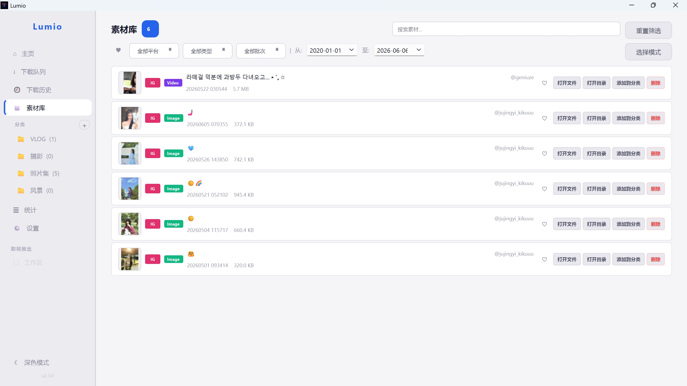
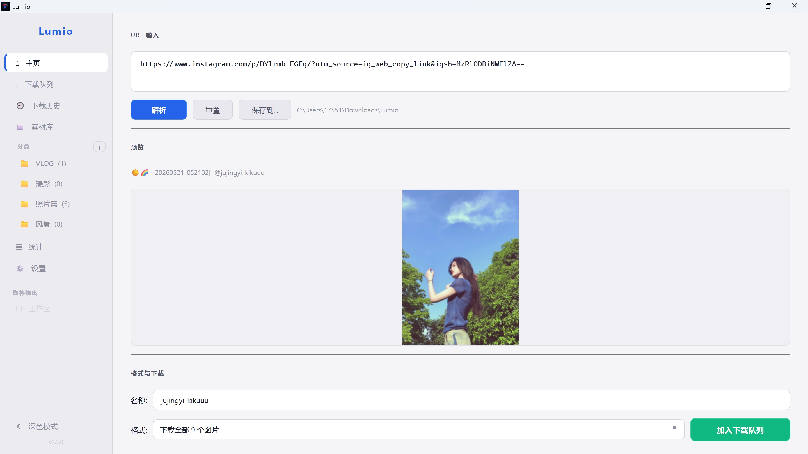
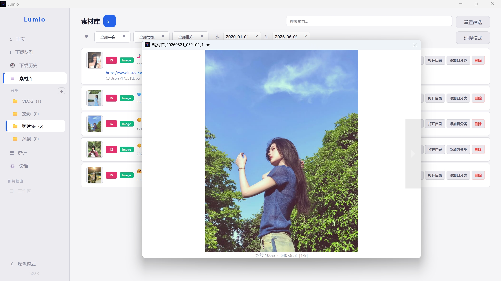
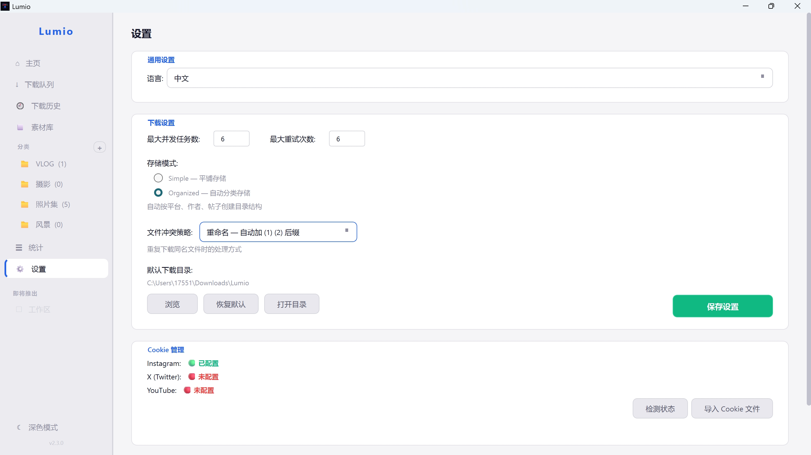

# Lumio

内容采集与素材管理桌面工具 — 通过分享链接下载 YouTube、Instagram、X (Twitter) 及国内主流平台（B站/抖音/快手/微博/小红书）的图片/视频，自动入库管理。



## 功能

### 平台支持

- **YouTube**：选择清晰度，自动合并视频+音频；支持频道/播放列表批量下载
- **Instagram**：图片帖、视频帖、混合轮播帖、主页批量下载；最高画质下载（cookie 模式调移动 API，复现 saveinta.com 机制）
- **X (Twitter)**：视频下载、图片下载（需 `auth_token` + `ct0` cookie）、用户主页批量下载
- **X-Sou 搜索**：Home 页面搜索按钮（设置页可开关，默认关闭含 18+ 警告），调 X-Sou API 搜索推文；结果列表含缩略图+预览+分页+勾选入队；`@username` 自动转 `from:username`
- **B站**：BV/av 号视频下载，b23.tv 短链自动展开；DASH 多清晰度（最高 8K，按账号权限降级）
- **抖音**：视频下载（多清晰度，自动 ttwid 访客标识，无需 cookie）、图文帖（note）下载、a_bogus 签名服务可选增强（拿 H.265 档位）
- **快手**：短视频解析下载
- **微博**：图片/视频/多图/转发/livephoto 下载；sinaimg.cn CDN 需要 Cookie + Referer
- **小红书**：图片/视频笔记下载，xhslink.com/xhslink.cn 短链自动展开

### 下载与队列

- 下载队列：暂停/继续/重试/恢复/全部操作；智能退避重试（5s→15s→30s）
- 断点续传：YouTube/X 中断后自动续传；直链下载支持 Range header + append 模式
- 错误分类：Cookie/网络/限流/内容/解析，显示友好提示
- 批量导入：粘贴多行 URL，一键全部加入队列
- 批量下载：IG/YouTube/X 主页或频道链接，弹出批量对话框
- 文件冲突策略：重命名/跳过/覆盖/每次询问
- 多流下载进度：yt-dlp 视频+音频合并时正确累计进度，避免 100% 后归 0

### 素材管理

- **素材库**：下载自动入库、缩略图预览、Collections 分类（右键重命名/删除）、收藏、多维搜索筛选（文本+平台+类型+收藏+日期范围+批次）、批量操作（全选/批量收藏/批量删除/批量加入 Collection）
- **素材预览**：图片缩放/平移/多图切换；视频/音频内置播放器
- **下载历史**：搜索、平台筛选、打开文件/目录、批量批次分组折叠
- **下载统计**：总下载数、体积、成功率、今日下载、各平台数量

### 系统集成

- **Inbox 收件箱**：接收浏览器扩展采集的 URL，等待用户下载；支持格式选择（单个）/最高画质（批量）
- **通知系统**：环境/依赖/版本通知 + 分类筛选 + 永久通知（IG 风险提示、VPN/代理、媒体播放器推荐、Telegram Bot、Apify Token）
- **系统托盘**：关闭窗口最小化到托盘，保持后台运行
- **本地 API 服务**：Flask 接收浏览器扩展采集内容（127.0.0.1:38900）
- **Telegram Bot 服务**：轮询 Bot API，接收用户发送的链接/媒体，自动写入 Inbox；支持本地 Bot API Server 突破 20MB 限制
- **Apify IG 代理**：通过 Apify Actor 代理提取 Instagram 数据，避免账号风控
- **缓存管理**：统一管理 4 个缓存目录（inbox_media/thumbs/provider_cache/preview），支持手动/定时清理
- **凭证管理**：设置页 Cookie/API 凭证分组可折叠（QToolButton），避免凭证过多布局混乱

### 界面

- V4 Provider 架构统一支持所有平台；短链自动展开；URL → MediaInfo 两级缓存
- Home 预览：清晰度选择列独立放置于文件名与格式之间；多素材预览卡片点击选中、按钮入队；预览区比例自适应（横屏/正方形/竖屏）
- Sidebar 红点徽章（1-9 圆点 / 10-99 胶囊 / ≥100 显示 99+）
- Light / Dark 主题切换
- 中/英双语界面

## 安装

### 方式一：下载 .exe（推荐，无需 Python 环境）

从 [Releases](../../releases) 页面下载对应系统的安装包，解压后直接运行。

### 方式二：pip 安装

```powershell
# 需要 Python 3.10+
pip install .
lumio
```

### 方式三：开发者模式

```powershell
pip install -e .
python -m lumio.main
```

## 运行测试

```powershell
pip install -e ".[test]"
PYTHONPATH=src python -m pytest tests/ -v --ignore=tests/test_integration.py
```

## 截图

| 使用界面 | 预览功能 | 设置界面 |
|---------|---------|---------|
|  |  |  |

## 浏览器扩展

Chrome/Edge 共用（Manifest V3）：

- 右键菜单发送页面/链接/视频/图片到 Lumio
- content.js 提取 YouTube/X 页面元数据
- IG 一次性注入 `ig_extract.js` 从 DOM 读取媒体直链（不调 IG API，避免账号风险）

详见 [extension/](extension/) 目录。

## 技术栈

Python 3.10+ / PySide6 / QML (QtQuick) / yt-dlp / instaloader / imageio-ffmpeg / requests / SQLAlchemy / Pillow / Flask / python-telegram-bot / apify-client / V4 Provider 系统

## 许可证

[MIT License](LICENSE) — 仅供个人学习使用。
