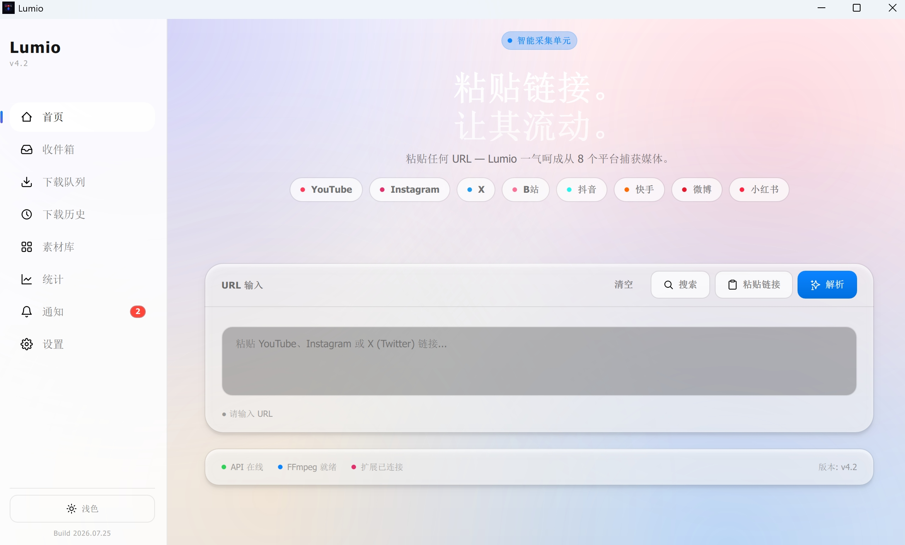

# Lumio

> 内容采集与素材管理桌面工具 — 通过分享链接下载 YouTube、Instagram、X (Twitter) 及国内主流平台（B 站 / 抖音 / 快手 / 微博 / 小红书）的图片 / 视频，自动入库管理。



[](src/lumio/__init__.py)
[](LICENSE)
[](#安装)

---

## 目录

- [功能一览](#功能一览)
- [安装](#安装)
- [快速开始](#快速开始)
- [浏览器扩展](#浏览器扩展)
- [素材管理](#素材管理)
- [配置说明](#配置说明)
- [开发者指南](#开发者指南)
- [技术栈](#技术栈)
- [常见问题](#常见问题)
- [许可证](#许可证)

---

## 功能一览

### 支持平台

| 平台 | 能力 | 备注 |
|------|------|------|
| **YouTube** | 视频下载（清晰度选择，自动合并视频 + 音频）；频道 / 播放列表批量 | 推荐 cookie 模式避开限流 |
| **Instagram** | 图片 / 视频 / 轮播帖；主页批量；最高画质直链 | cookie 模式调移动 API；或浏览器扩展安全下载 |
| **X (Twitter)** | 视频 / 图片下载；用户主页批量；X-Sou 关键词搜索 | 需 `auth_token` + `ct0` cookie |
| **B 站** | BV / av 号视频；b23.tv 短链展开；DASH 多清晰度 | — |
| **抖音** | 视频多清晰度；图文帖；v.douyin.com 短链 | 自动 ttwid 访客标识，免 cookie |
| **快手** | 短视频解析下载 | — |
| **微博** | 图片 / 视频 / 多图 / 转发 / livephoto | sinaimg.cn 需 cookie + Referer |
| **小红书** | 图片 / 视频笔记；xhslink.com / xhslink.cn 短链 | 自动提取 xsec_token |

### 核心能力

- **下载队列**：暂停 / 继续 / 重试 / 恢复 / 全局操作；智能退避重试（5s → 15s → 30s）；YouTube / X 断点续传；直链下载支持 Range + append
- **错误分类**：Cookie / 网络 / 限流 / 内容 / 解析，UI 显示友好提示
- **文件冲突策略**：重命名（默认）/ 跳过 / 覆盖 / 每次询问
- **素材库**：下载自动入库、缩略图预览、Collections 分类、收藏、多维搜索筛选、批量操作
- **素材预览**：图片缩放 / 平移 / 多图切换；视频 / 音频内置播放器
- **下载历史**：搜索、平台筛选、批次分组折叠
- **统计**：总下载数、体积、成功率、今日下载、各平台数量
- **Inbox 收件箱**：接收浏览器扩展 + Telegram Bot 采集内容
- **通知系统**：环境 / 依赖 / 版本通知 + 永久通知（IG 风险提示等）
- **系统托盘**：关闭窗口最小化到托盘，后台保持运行
- **主题与语言**：Light / Dark 主题；中 / 英双语
- **跨平台**：Windows NSIS / macOS DMG（Apple Silicon）/ Linux AppImage + deb + rpm

---

## 安装

### 方式一：下载安装包（普通用户推荐）

前往 [Releases](../../releases) 页面下载对应系统的安装包，双击安装即可。安装包内已包含 Electron 前端 + PyInstaller 打包的 Python 后端，**无需任何额外环境**。

| 系统 | 文件 | 说明 |
|------|------|------|
| Windows x64 | `Lumio-Setup-x.y.z.exe` | NSIS 安装包，双击安装 |
| macOS Apple Silicon | `Lumio-x.y.z-arm64.dmg` | M1 / M2 / M3 / M4 Mac |
| Linux x64 | `Lumio-x.y.z-x86_64.AppImage` | `chmod +x` 后直接运行 |
| Linux x64 | `lumio_x.y.z_amd64.deb` | Debian / Ubuntu |
| Linux x64 | `lumio-x.y.z.x86_64.rpm` | Fedora / RHEL / openSUSE |

> **首次启动**会拉起内置 Python 后端，可能需要 5–10 秒。如遇 Windows SmartScreen 警告，点击「更多信息」→「仍要运行」即可（本项目未购买代码签名证书，所有源码均开源可查）。

### 方式二：开发者模式

**前置要求**：Python 3.10+ / Node.js 20+ / npm

```powershell
# 1. 克隆仓库
git clone https://github.com/Roseannepark0211/Lumio.git
cd Lumio

# 2. 安装 Python 后端依赖（含 yt-dlp / instaloader / FastAPI 等）
pip install -e .

# 3. 安装前端依赖并启动开发模式
cd frontend
npm install
npm run dev:electron
```

`dev:electron` 会同时拉起 Vite Dev Server、Electron 主进程和 FastAPI 子进程，支持前端热重载。

### 方式三：仅运行 Python 后端

```powershell
pip install -e .
lumio-api              # 启动 FastAPI 服务（127.0.0.1:38900）
```

---

## 快速开始

### 1. 粘贴链接下载

1. 启动 Lumio，默认进入「主页」
2. 在输入框粘贴视频 / 图片分享链接（支持 YouTube / IG / X / B 站 / 抖音 / 快手 / 微博 / 小红书）
3. 自动识别平台并解析，显示预览（含标题、作者、缩略图、时长、清晰度选项）
4. 选择清晰度 → 点击「加入队列」→ 切换到「下载」页面查看进度

> **批量导入**：在输入框粘贴多行 URL（每行一个），点击「批量导入」逐个解析入队。

### 2. 平台批量下载

| 平台 | 输入 | 说明 |
|------|------|------|
| YouTube | 频道 / 播放列表链接 | 弹出批量对话框选择范围 |
| Instagram | `@用户名` 或主页链接 | 需导入 cookie |
| X (Twitter) | `@用户名` 或主页链接 | 仅枚举含媒体推文，需 cookie |

### 3. 历史与素材库

- **下载历史**：每个任务完成自动记录，支持搜索 / 平台筛选 / 批次分组；可打开文件 / 打开目录 / 删除
- **素材库**：下载自动入库，支持缩略图预览、Collections 分类、收藏、多维筛选（文本 + 平台 + 类型 + 收藏 + 日期 + 批次）、批量操作

---

## 浏览器扩展

Lumio 提供浏览器扩展（Chrome / Edge 共用，Manifest V3），让你在浏览网页时一键发送媒体到 Lumio 桌面端。

### 安装扩展

#### 方式一：下载预编译 zip（推荐）

1. 前往 [Releases](../../releases) 页面，下载最新版的 `lumio-extension-vX.X.X.zip`
2. 解压到任意目录
3. 打开 Chrome / Edge → 地址栏输入 `chrome://extensions`（Edge 为 `edge://extensions`）
4. 打开右上角「开发者模式」
5. 点击「加载已解压的扩展程序」→ 选择解压后的目录
6. 扩展图标出现在工具栏，完成安装

#### 方式二：从源码构建

```powershell
cd extension-v2
npm install
npm run build
# 产物在 extension-v2/dist/，按方式一第 3-6 步加载
```

### 连接 Lumio 桌面端

1. 启动 Lumio 桌面端（扩展需要与桌面端通信）
2. 点击扩展图标打开弹窗
3. 弹窗会自动检测本地 Lumio 服务（127.0.0.1:38900），显示「已连接」状态
4. 如未自动连接，点击「手动连接」并确认 Lumio 桌面端正在运行

### 使用扩展

#### 右键菜单（最常用）

在任意网页上右键，根据上下文会出现以下选项：

| 右键位置 | 菜单项 | 行为 |
|---------|--------|------|
| 页面空白处 | 「发送此页面到 Lumio」 | 提取当前页面媒体并发送 |
| 链接上 | 「发送此链接到 Lumio」 | 直接发送该链接 URL |
| 视频上 | 「发送此视频到 Lumio」 | 提取视频直链并发送 |
| 图片上 | 「发送此图片到 Lumio」 | 提取图片直链并发送 |

发送后内容会出现在 Lumio 桌面端的「Inbox 收件箱」页面，可批量选择下载。

#### 平台专项支持

扩展对部分平台做了深度适配，能在页面内直接提取媒体元数据（无需桌面端二次解析）：

| 平台 | 页面类型 | 提取能力 |
|------|---------|---------|
| **YouTube** | 视频详情页 | 标题 / 作者 / 时长 / 缩略图 / 直链 |
| **X (Twitter)** | 推文详情页 | 标题 / 作者 / 媒体类型 / 直链 |
| **Instagram** | 帖子详情页 | **一次性注入** `ig_extract.js` 从 DOM 读取 `<video src>` / `og:image` / `og:video` 直链（**不调用 IG API，避免账号风控**） |
| **B 站** | 视频详情页 | BV 号 / 标题 / 作者 |
| **抖音** | 视频详情页 | aweme_id / 标题 / 作者 |
| **微博** | 详情页 | 文章 ID / 媒体类型 |
| **小红书** | 笔记详情页 | 笔记 ID / 标题 |
| **快手** | 视频详情页 | 视频 ID / 标题 |

#### 弹窗功能

点击扩展图标打开弹窗，包含以下功能：

- **连接状态**：显示与 Lumio 桌面端的连接情况
- **手动发送**：直接输入 URL 发送到桌面端
- **最近历史**：显示最近发送的 10 条记录
- **Inbox 同步**：查看桌面端 Inbox 当前待处理项数量

#### IG 多图帖子（Carousel）特殊处理

Instagram 多图帖子 DOM 仅渲染当前 + 相邻 slide（约 4 张），扩展会**模拟点击「下一张」按钮逐张翻页**，去重合并后发送完整图片列表。这是 ext-v4.4.6 新增能力，确保多图帖子完整下载。

### 扩展设置

弹窗右上角齿轮图标可打开设置：

- **API 地址**：默认 `http://127.0.0.1:38900`，一般无需修改
- **超时时间**：发送请求的超时阈值（默认 10s）

### 扩展与桌面端的协作关系

```
浏览器扩展                    Lumio 桌面端
─────────────                ─────────────
右键菜单 / 弹窗   ──POST──→   Local API Server (Flask)
                            │
                            ↓
                          Inbox 收件箱
                            │
                            ↓
                          用户在 Inbox 选择
                          「批量下载」或「单条下载」
                            │
                            ↓
                          下载队列 → 素材库
```

**为什么需要扩展？**
- **IG 安全下载**：直接调用 IG 移动 API 有账号风控风险，扩展从 DOM 读取直链绕过 API 调用
- **页面上下文**：扩展能访问当前页面的 DOM 和元数据，桌面端只能拿到 URL
- **批量采集**：浏览时随手发送，回到桌面端统一处理

---

## 素材管理

### 素材库


- **自动入库**：每个下载任务完成自动入库，含标题 / 作者 / 平台 / 媒体类型 / 文件路径 / 发布时间 / 批次 ID
- **缩略图预览**：启动时自动为缺失缩略图的素材后台生成
- **Collections 分类**：创建自定义分类，右键支持重命名 / 删除（仅删分类，不删素材）
- **收藏**：点击素材卡片收藏按钮切换收藏状态
- **多维筛选**：文本（标题 / 作者 / URL / 文件路径 / 发布时间）+ 平台 + 媒体类型 + 收藏 + 日期范围 + 批次
- **批量操作**：全选 / 取消全选 / 批量收藏 / 批量删除 / 批量加入 Collection

### 素材预览

点击素材缩略图打开内置预览：

- **图片**：缩放 / 平移 / 多图左右切换
- **视频 / 音频**：内置播放器（基于 QMediaPlayer），自定义控制栏
- **不支持格式**：显示错误提示

### 下载历史

- 搜索（标题 / 作者 / URL / 文件路径 / 发布时间，大小写不敏感）
- 平台筛选下拉
- 按 `batch_id` 分组折叠展示（批量下载共享同一批次 ID）
- 单条操作：打开文件 / 打开目录 / 删除

---

## 配置说明

### Cookie 导入（必需场景）

部分平台必须导入 cookie 才能完整使用：

| 平台 | 必需 cookie | 导入方式 |
|------|------------|---------|
| Instagram | session-id | 设置 → Cookie → 导入 Netscape 格式 cookie 文件 |
| X (Twitter) | auth_token + ct0 | 同上 |
| 微博 | SUB + SUBP | 同上（sinaimg.cn CDN 需要） |

**Cookie 文件格式**：Netscape format（即浏览器扩展「Get cookies.txt LOCALLY」等工具导出的 `.txt` 文件）。

**合并模式**：多平台 cookie 可共存于同一文件，Lumio 按 `domain + name` 去重合并，不会覆盖已有 cookie。

### 下载设置

- **文件冲突策略**：rename（默认，自动加 `(1)` 后缀）/ skip / overwrite / ask
- **并发数**：同时下载任务数上限
- **下载目录**：默认 `~/Downloads/Lumio`
- **文件名模板**：默认用「作者名 + 发布时间戳」

### 缓存管理

设置 → 缓存管理，统一管理 4 个缓存目录：

| 目录 | 用途 |
|------|------|
| `inbox_media` | Inbox 采集的媒体文件（Telegram Bot 下载） |
| `thumbs` | 素材库缩略图 |
| `provider_cache` | Provider 解析缓存（URL → MediaInfo） |
| `preview` | 预览临时文件 |

支持手动清理 + 自动清理模式（关闭 / 每次启动 / 每天 / 每周）+ 保留天数与单目录上限。

### Telegram Bot（可选）

设置 → Telegram，配置 Bot Token + 配对码，让 Telegram Bot 接收你发送的链接 / 媒体 / 笔记 / 相册，自动下载媒体到 `~/.lumio/inbox_media/` 并写入 Inbox。支持多设备绑定。

### Apify IG 代理（可选）

设置 → Apify，配置 Token 后，Instagram 解析走 Apify Actor 代理，避免直接调用 IG 移动 API 导致账号风控。

---

## 开发者指南

### 架构

Lumio 采用 **Electron + React 前端 / Python FastAPI 后端** 双进程架构：

```
┌─────────────────────────────┐     HTTP/WS      ┌──────────────────────────┐
│  Electron + React           │  ←───────────→   │  Python FastAPI          │
│  - Vite + TypeScript        │                  │  - 包装现有 manager      │
│  - Tailwind CSS             │                  │  - WebSocket 推送进度    │
│  - Zustand 状态管理         │                  │  - yt-dlp / instaloader  │
└─────────────────────────────┘                  └──────────────────────────┘
                                                         ↓
                                                  Provider 系统（统一所有平台入口）
                                                  yt-dlp / instaloader /
                                                  SQLAlchemy / Flask /
                                                  Telegram Bot / Apify
```

- **前端**：Electron 主进程 spawn FastAPI 子进程（随机端口 + token 鉴权），退出时优雅关闭后端
- **后端**：FastAPI 包装现有 manager，零业务逻辑改动，与 QML 版共享 `~/.lumio/` 数据
- **通信**：HTTP（REST API） + WebSocket（实时进度推送 / 事件总线）

### 目录结构

```
src/lumio/                 — Python 后端
  main.py                  — 入口（QApplication + QML 启动）
  api_fastapi.py           — FastAPI 服务（React 前端的后端 API）
  downloader.py            — 下载引擎（yt-dlp + GraphQL + 直链）
  queue_manager.py         — 下载队列管理
  library_manager.py       — 素材库管理（SQLAlchemy）
  inbox_manager.py         — 收件箱管理
  providers/               — V4 统一 Provider 系统（所有平台入口）
  utils/                   — 工具函数（config / url_parser / media_utils 等）
  gui/                     — QML 桥接层（迁移期保留）

frontend/                  — Electron + React 前端
  src/                     — React 页面（Home / Inbox / Downloads / History / Library / Stats / Settings）
  electron/                — Electron 主进程 + preload
  electron-builder.cjs     — 打包配置

extension-v2/              — 浏览器扩展（Manifest V3）
  src/background/          — Service Worker（右键菜单 + API 调用）
  src/content/             — Content Script（平台元数据提取）
  src/popup/               — 弹窗 UI（React + Zustand）

tests/                     — 单元测试 + 集成测试
docs/images/               — README 截图
```

### 常用命令

```powershell
# 单元测试（忽略需真实网络的集成测试）
PYTHONPATH=src python -m pytest tests/ -v --ignore=tests/test_integration.py

# 启动 GUI
python -m lumio.main

# 启动 FastAPI 服务（仅后端）
python -m lumio.api_fastapi

# 前端开发模式（热重载）
cd frontend && npm run dev:electron

# 构建前端
cd frontend && npm run build

# 构建浏览器扩展
cd extension-v2 && npm run build
```

### 数据目录

所有用户数据存放在 `~/.lumio/`：

| 文件 / 目录 | 用途 |
|------------|------|
| `library.db` | 素材库 + 收件箱 SQLite（SQLAlchemy ORM） |
| `history.json` | 下载历史 |
| `config.json` | 配置（主题 / 语言 / 下载设置 / cookie 路径等） |
| `queue.json` | 下载队列持久化（原子写入） |
| `notifications.json` | 通知 |
| `inbox_media/` | Inbox 采集的媒体文件 |
| `thumbs/` | 缩略图缓存 |
| `provider_cache/` | Provider 解析缓存 |
| `preview/` | 预览临时文件 |

---

## 技术栈

**前端**：Electron / React / TypeScript / Vite / Tailwind CSS / Zustand / react-window

**后端**：Python / FastAPI / yt-dlp / instaloader / SQLAlchemy / Pillow / Flask / python-telegram-bot / apify-client / imageio-ffmpeg

**构建**：electron-builder（三平台矩阵）/ PyInstaller（Python 后端打包）/ Vite + @crxjs/vite-plugin（扩展）

**CI/CD**：GitHub Actions（tag push 触发，三平台并行构建 + 扩展打包 + 自动 Release）

---

## 常见问题

<details>
<summary><b>首次启动很慢？</b></summary>

正常现象。Electron 主进程首次启动会解压内置 Python 后端（PyInstaller 打包），约 5–10 秒。后续启动会快很多。
</details>

<details>
<summary><b>Windows SmartScreen 警告？</b></summary>

点击「更多信息」→「仍要运行」即可。本项目未购买代码签名证书，所有源码均开源可查。
</details>

<details>
<summary><b>macOS 提示「无法验证开发者」？</b></summary>

右键点击应用图标 → 选择「打开」绕过 Gatekeeper；或终端执行：
```bash
xattr -dr com.apple.quarantine /Applications/Lumio.app
```
</details>

<details>
<summary><b>Instagram 下载失败？</b></summary>

1. 确认已导入 cookie（设置 → Cookie → 导入 Netscape 格式文件）
2. 或使用浏览器扩展右键发送（安全模式，不调 IG API）
3. 频繁调用 IG 移动 API 会导致账号风控，建议优先使用扩展
</details>

<details>
<summary><b>X (Twitter) 图片下载失败？</b></summary>

X 图片下载和批量枚举必须导入 `auth_token` + `ct0` 两个 cookie。设置 → Cookie → 导入。
</details>

<details>
<summary><b>下载中断后能续传吗？</b></summary>

- YouTube / X：支持断点续传（yt-dlp `continuedl` + `keep_fragments`）
- 直链下载：支持 Range header + append 模式
- Instagram：因 instaloader 限制不支持续传
</details>

<details>
<summary><b>扩展显示「未连接」？</b></summary>

1. 确认 Lumio 桌面端正在运行
2. 确认本地 API 服务（127.0.0.1:38900）未被占用
3. 点击弹窗「手动连接」按钮重试
4. 检查防火墙是否拦截本地端口
</details>

<details>
<summary><b>扩展发送后桌面端 Inbox 没有内容？</b></summary>

1. 确认扩展弹窗显示「已连接」
2. 切换到桌面端「Inbox」页面
3. 检查 Inbox 筛选器是否设为「新内容」（默认）
4. 重启 Lumio 桌面端后重试
</details>

<details>
<summary><b>支持代理吗？</b></summary>

支持。设置 → 下载 → 代理，填写 HTTP / HTTPS / SOCKS5 代理地址。yt-dlp 原生支持代理；直链下载用 `requests.Session(trust_env=True)` 读取系统代理。
</details>

---

## 截图

| 主页 | 素材库 |
|------|--------|
|  |  |

---

## 许可证

[MIT License](LICENSE) — 仅供个人学习使用。

## 致谢

- [yt-dlp](https://github.com/yt-dlp/yt-dlp) — YouTube / X 视频下载引擎
- [instaloader](https://github.com/instaloader/instaloader) — Instagram 下载（迁移中逐步弃用）
- [FastAPI](https://fastapi.tiangolo.com/) — 后端 API 框架
- [Electron](https://www.electronjs.org/) — 跨平台桌面应用框架
- [React](https://react.dev/) — 前端 UI 框架
- [Tailwind CSS](https://tailwindcss.com/) — 原子化 CSS 框架
- [imageio-ffmpeg](https://github.com/imageio/imageio-ffmpeg) — 内置 ffmpeg 二进制
- [SQLAlchemy](https://www.sqlalchemy.org/) — Python ORM
